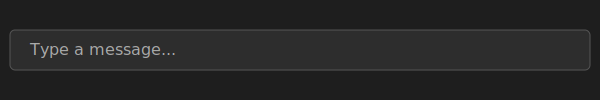

# Visual Studio Code

## Overview
Visual Studio Code is a lightweight yet powerful source code editor built with web technologies. It now includes an integrated chat bar to help you explore and modify code using natural language.

## Features
- Syntax highlighting and IntelliSense for many languages
- Debugging for Node.js, JavaScript, and TypeScript
- Integrated Git support
- Extensive extension marketplace
- Customizable themes and settings
- Built-in chat assistance

## Setup
1. **Install dependencies**
   ```
   npm install
   ```
2. **Compile and watch for changes**
   ```
   npm run watch
   ```
3. **Launch the editor**
   ```
   ./scripts/code.sh
   ```

## Chat Usage
Use the chat bar at the bottom of the editor to ask questions, run commands, or get code suggestions.



## Future Work
Planned enhancements include:
- Slash commands for quick actions
- Multi-file summarization
- Plug-in API for custom chat providers
