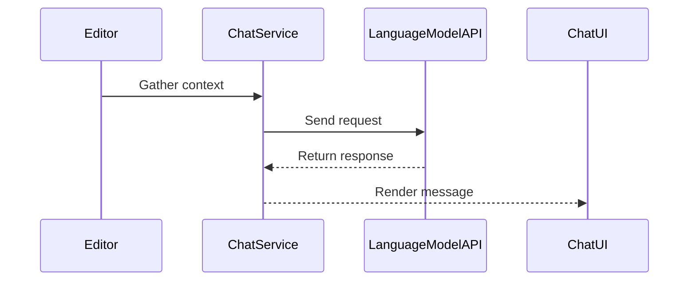
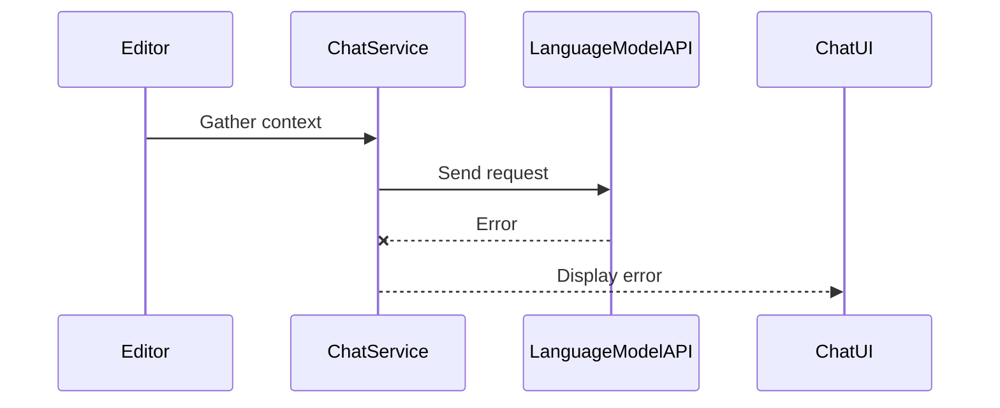

# Chat Architecture

This document outlines the flow of a chat request.

The chat flow is: editor context → API request → response rendering.

## Request and Response

## Error Handling

## Related Services and Modules

- `src/vs/workbench/contrib/chat/common/chatService.ts`
- `src/vs/workbench/contrib/chat/common/chatServiceImpl.ts`
- `src/vs/workbench/contrib/chat/browser/chatWidget.ts`
- `src/vs/workbench/contrib/chat/browser/chatViewPane.ts`

