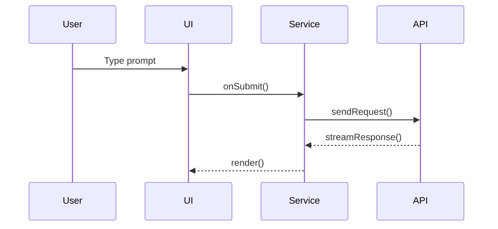

# Chat Architecture

## Module Layout
- `src/chat/ui` – renders the chat panel and input bar
- `src/chat/services` – orchestrates requests and maintains sessions
- `src/chat/commands` – exposes chat actions inside the editor
- `src/services/openai` – language model client for API calls

## Data Flow
1. User enters a prompt in the chat UI.
2. The UI forwards the message to `ChatService`.
3. `ChatService` gathers editor context and constructs a request.
4. `OpenAIClient` sends the request to the language model.
5. The model streams a response back to `ChatService`.
6. `ChatService` persists results and notifies the UI to render output.

## Related Files
- `src/vs/workbench/contrib/chat/common/chatService.ts`
- `src/vs/workbench/contrib/chat/common/chatServiceImpl.ts`
- `src/chat/ui/panel.ts`
- `src/services/openai/client.ts`
